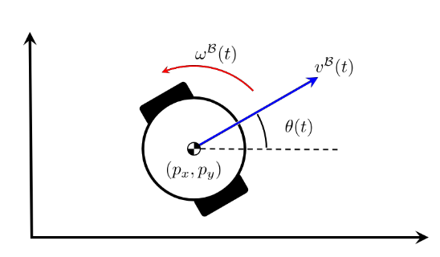
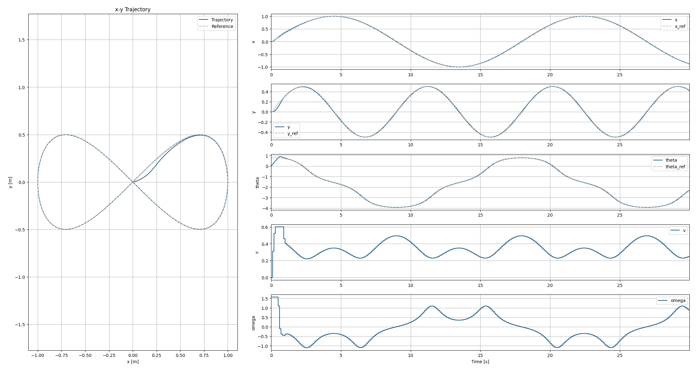

# OpEn_unicycle

[](https://opensource.org/licenses/BSD-2-Clause)

This repository contains an implementation of a Nonlinear Model Predictive Control (NMPC) for a unicycle model using the OpEn (Optimization Engine) package.  
The code is structured to allow easy configuration and simulation of the unicycle's trajectory tracking capabilities.

## Overview

The project implements:
- U**nicycle mobile robot model**
```math
f(\bm{x}, \bm{u}) = \begin{bmatrix}
\dot{p}_x \\
\dot{p}_y \\
\dot{\theta}
\end{bmatrix} = \begin{bmatrix}
v^{\mathcal{B}} \cos\theta \\
v^{\mathcal{B}} \sin\theta \\
\omega
\end{bmatrix}
```
where $\bm{x} = [p_x,\ p_y,\ \theta]^T$ is the state vector with the position $(p_x, p_y)$ and orientation $(\theta)$ in the inertial frame, $v^{\mathcal{B}}$ is the linear velocity in the body frame and $\omega$ is the angular velocity.
<p align="center">
  
</p>

- **NMPC controller** using OpEn optimization engine
```math
\min_{u} \sum_{k=0}^{N-1} \|x_k - x_{ref,k}\|_Q^2 + \|u_k\|_R^2 + \|x_N - x_{ref,N}\|_{Q_N}^2
``` 
- **Reference trajectory generation** (figure-8 pattern)
- **Real-time simulation** with configurable parameters
- **Visualization** of trajectory tracking performance

## Project Structure

```
OpEn_unicycle/
├── build/                   # Generated OpEn optimizers (auto-created)
├── config/
│   └── NMPC_config.yaml      # MPC configuration parameters
├── images/                   # Images for README
├── model/
│   ├── __init__.py
│   └── dynamics.py           # Unicycle dynamics model
├── optimizer/
│   ├── __init__.py
│   ├── optimizer.py          # OpEn optimizer setup
│   └── cost.py              # Cost function definitions
├── trajectory/
│   ├── __init__.py
│   └── ref_traj_utils.py    # Reference trajectory generation
├── main_NMPC.py            # Main simulation script
├── requirements.txt        # Python dependencies
└── README.md
```

## Requirements

This code requires the following dependencies:
- **[Rust](https://rust-lang.org/tools/install/)** (for OpEn package compilation)
- **[OpEn Python package](https://alphaville.github.io/optimization-engine/)** (optimization engine)
- **Python 3.8+** with packages listed in `requirements.txt`

Please follow [the instructions on the OpEn website](https://alphaville.github.io/optimization-engine/docs/installation) to install OpEn properly.


# Installation
1. Clone the repository:
```bash
git clone https://github.com/Trigger-FK/OpEn_unicycle.git
```
2. Navigate to the project directory:
```bash
cd OpEn_unicycle
```
3. Install the required Python packages:
```bash
pip install -r requirements.txt
```
## Usage

### Running the Simulation

1. **Build and run the NMPC optimizer:**
```bash
python main_NMPC.py
```

2. **Interactive prompts:**
   - When prompted with `Do you want to build the optimizer? (y/n):` 
     - Enter `y` to build the optimizer (required for first run or after config changes)
     - Enter `n` to skip the build process and proceed directly to simulation

3. **Simulation output:**
   - The simulation will run for 30 seconds (configurable)
   - Real-time trajectory tracking performance is displayed
   - Results are visualized in plots showing:
     - State trajectories $(x, y, \theta)$ vs reference
     - Control inputs $(v, \omega)$ over time
     - 2D trajectory plot (x-y plane)

### Configuration

The MPC controller can be configured by editing `config/NMPC_config.yaml`:

```yaml
# MPC Params
state_dim: 3
input_dim: 2
sampling_time: 0.1
horizon_len: 10
umin: [0.0, -1.57]
umax: [0.6, 1.57]
Q:    [20, 30, 2]
R:    [0.1, 0.01]
QN:   [40, 60, 4]
```

### Key Parameters

- **Sampling Time**: Controls the MPC update frequency
- **Horizon Length**: Number of prediction steps (longer = better performance, slower computation)
- **Weight Matrices**: 
  - `Q`: Penalizes state tracking errors
  - `R`: Penalizes control effort
  - `QN`: Terminal cost weights (typically higher than Q)

## Results

After simulation, the results will be shown in plots:


<!-- ## Features

- **Fast optimization**: Uses Rust-based OpEn solver for real-time performance
- **Configurable trajectories**: Easy to modify reference trajectory patterns
- **TCP interface**: Optimizer runs as a separate process for efficient communication
- **Modular design**: Clean separation of dynamics, cost functions, and optimization
- **Comprehensive visualization**: Multiple plot types for analysis -->

## Troubleshooting

- **Rust not found**: Ensure Rust is installed and in your PATH
- **OpEn build fails**: Check that all dependencies in `requirements.txt` are installed
- **TCP connection errors**: The optimizer automatically tries multiple ports (8333-8336)
- **Slow performance**: Reduce horizon length or increase sampling time in config

## License

This project is licensed under the BSD 2-Clause License - see the [LICENSE](LICENSE) file for details.

## Author

**Fumiya Matsuzaki** - [Trigger-FK](https://github.com/Trigger-FK)

## Acknowledgments

- [OpEn (Optimization Engine)](https://alphaville.github.io/optimization-engine/) - Fast and accurate embedded optimization
- [CasADi](https://web.casadi.org/) - Symbolic framework for automatic differentiation