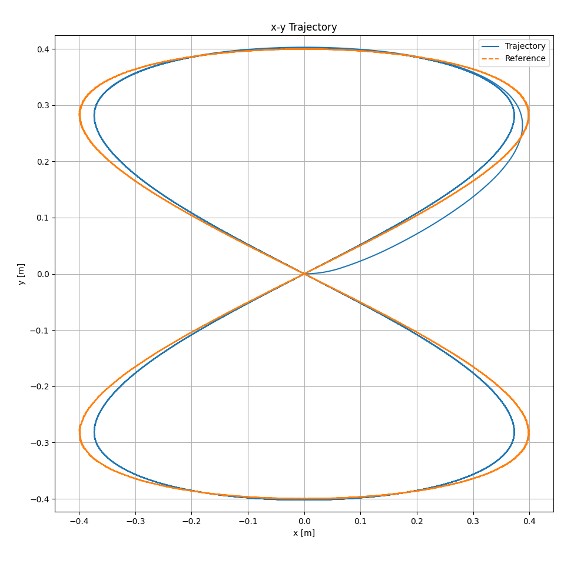

# OpEn_unicycle

This repository contains an implementation of a Nonlinear Model Predictive Control (NMPC) for a unicycle model using the OpEn (Optimization Engine) package.  
The code is structured to allow easy configuration and simulation of the unicycle's trajectory tracking capabilities.

## Overview

The project implements:
- **Unicycle dynamics model** with position $(x, y)$ and orientation $(\theta)$ states
```math
f(x) = \begin{bmatrix}
\dot{x} \\
\dot{y} \\
\dot{\theta}
\end{bmatrix} = \begin{bmatrix}
v \cos(\theta) \\
v \sin(\theta) \\
\omega
\end{bmatrix}
```
- **NMPC controller** using OpEn optimization engine
```math
\min_{u} \sum_{k=0}^{N-1} \|x_k - x_{ref,k}\|_Q^2 + \|u_k\|_R^2 + \|x_N - x_{ref,N}\|_{Q_N}^2
``` 
- **Reference trajectory generation** (figure-8 pattern)
- **Real-time simulation** with configurable parameters
- **Visualization** of trajectory tracking performance

## Project Structure

```
OpEn_unicycle/
├── config/
│   └── NMPC_config.yaml      # MPC configuration parameters
├── model/
│   ├── __init__.py
│   └── dynamics.py           # Unicycle dynamics model
├── optimizer/
│   ├── __init__.py
│   ├── optimizer.py          # OpEn optimizer setup
│   └── cost.py              # Cost function definitions
├── trajectory/
│   ├── __init__.py
│   └── ref_traj_utils.py    # Reference trajectory generation
├── build/                   # Generated OpEn optimizers (auto-created)
├── main_NMPC.py            # Main simulation script
├── requirements.txt        # Python dependencies
└── README.md
```

## Requirements

This code requires the following dependencies:
- **[Rust](https://rust-lang.org/tools/install/)** (for OpEn package compilation)
- **[OpEn Python package](https://alphaville.github.io/optimization-engine/)** (optimization engine)
- **Python 3.8+** with packages listed in `requirements.txt`

Please follow [the instructions on the OpEn website](https://alphaville.github.io/optimization-engine/docs/installation) to install OpEn properly.


# Installation
1. Clone the repository:
```bash
git clone https://github.com/Trigger-FK/OpEn_unicycle.git
```
2. Navigate to the project directory:
```bash
cd OpEn_unicycle
```
3. Install the required Python packages:
```bash
pip install -r requirements.txt
```
## Usage

### Running the Simulation

1. **Build and run the NMPC optimizer:**
```bash
python main_NMPC.py
```

2. **Interactive prompts:**
   - When prompted with `Do you want to build the optimizer? (y/n):` 
     - Enter `y` to build the optimizer (required for first run or after config changes)
     - Enter `n` to skip the build process and proceed directly to simulation

3. **Simulation output:**
   - The simulation will run for 30 seconds (configurable)
   - Real-time trajectory tracking performance is displayed
   - Results are visualized in plots showing:
     - State trajectories $(x, y, \theta)$ vs reference
     - Control inputs $(v, \omega)$ over time
     - 2D trajectory plot (x-y plane)

### Configuration

The MPC controller can be configured by editing `config/NMPC_config.yaml`:

```yaml
# MPC Parameters
state_dim: 3              # State dimension [x, y, θ]
input_dim: 2              # Input dimension [v, ω]
sampling_time: 0.1        # MPC sampling time (seconds)
horizon_len: 20           # Prediction horizon length
umin: [-10, -10]         # Control input lower bounds [v_min, ω_min]
umax: [10, 10]           # Control input upper bounds [v_max, ω_max]
Q: [1, 1, 1]             # State tracking weights [x, y, θ]
R: [0.01, 0.01]          # Control input weights [v, ω]
QN: [2, 2, 2]            # Terminal state weights [x, y, θ]
```

### Key Parameters

- **Sampling Time**: Controls the MPC update frequency
- **Horizon Length**: Number of prediction steps (longer = better performance, slower computation)
- **Weight Matrices**: 
  - `Q`: Penalizes state tracking errors
  - `R`: Penalizes control effort
  - `QN`: Terminal cost weights (typically higher than Q)

## Results

After simulation, the results will be shown in plots:



## Features

- **Fast optimization**: Uses Rust-based OpEn solver for real-time performance
- **Configurable trajectories**: Easy to modify reference trajectory patterns
- **TCP interface**: Optimizer runs as a separate process for efficient communication
- **Modular design**: Clean separation of dynamics, cost functions, and optimization
- **Comprehensive visualization**: Multiple plot types for analysis

## Troubleshooting

- **Rust not found**: Ensure Rust is installed and in your PATH
- **OpEn build fails**: Check that all dependencies in `requirements.txt` are installed
- **TCP connection errors**: The optimizer automatically tries multiple ports (8333-8336)
- **Slow performance**: Reduce horizon length or increase sampling time in config